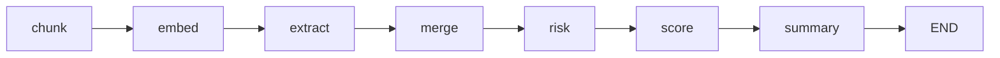
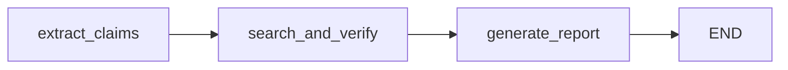

# Agents

This folder holds LangGraph-based agents used in NeuroShield. Use this document if you are wiring **APIs**, **UIs**, or **integrations** around the **privacy policy analyzer** or the **fact-check** pipeline.

## Folder map

| Path | Role |
|------|------|
| [`privacy_agent/`](privacy_agent/) | Privacy policy analysis: chunk, embed, structured extraction, risk/score, summary, optional RAG chat |
| [`fact_check_agent/`](fact_check_agent/) | Claim extraction, web search + verification (Tavily), narrative report |
| [`shared/`](shared/) | Shared OpenAI chat + embeddings (`llm.py`), small UI helpers (`utils.py`) |
| [`ui/`](ui/) | Temporary Streamlit demo UI for the privacy agent only (not the long-term product surface) |

Project dependencies and Python version live at the repo root: [`requirements.txt`](../requirements.txt), [`pyproject.toml`](../pyproject.toml) (Python **>= 3.13**).

---

## Environment variables

| Variable | Used by | Purpose |
|----------|---------|---------|
| `OPENAI_API_KEY` | Privacy agent, fact-check agent | Chat completions and (privacy) embeddings |
| `TAVILY_API_KEY` | Fact-check agent only | Web search in verification step |

Load keys via `.env` at the repo root (`python-dotenv`).

---

## Privacy agent (`privacy_agent`)

### What it does

Ingests raw privacy policy text, splits it into chunks, builds a **FAISS** vector store for retrieval, runs **parallel LLM extractions** per chunk into a fixed schema, merges results, applies **rule-based** risk flags and a numeric score, then generates a short **user-facing summary**.

### Pipeline



### How to run

- **From repo root** (package imports):

  ```bash
  python -m agents.privacy_agent.main
  ```

- **Streamlit UI** (privacy only):

  ```bash
  streamlit run agents/ui/app.py
  ```

  The app caches the compiled graph with `@st.cache_resource`, invokes it when the user clicks **Analyze**, then shows score, risk band, structured fields, risks, summary, and a chat sidebar.

  This Streamlit app is **temporary** for local/demo use; production integrations should call the graph via APIs or a dedicated frontend (see **Notes for frontend engineers** below).

### Input contract

Invoke the compiled graph with a dict matching [`GraphState`](privacy_agent/state.py):

| Field | Type | Required |
|-------|------|----------|
| `raw_text` | `string` | Yes (non-empty for meaningful output) |

Example:

```python
from agents.privacy_agent.graph import build_graph

app = build_graph()
result = app.invoke({"raw_text": policy_text})
```

### Output contract (what to expose to clients)

Fields most useful for APIs and frontends:

| Field | Type | Notes |
|-------|------|--------|
| `structured_data` | `dict` | Keys: `data_collected`, `data_usage`, `third_party_sharing`, `tracking_methods` (lists), `retention_policy` (string). JSON-serializable. |
| `risks` | `list[str]` | Rule-based strings from `risk_node` in [`nodes.py`](privacy_agent/nodes.py). |
| `score` | `int` | 0–100 from `score_node`; higher is better. |
| `summary` | `string` | LLM-generated bullets + overall judgment line. |

**Not JSON-serializable by default:**

| Field | Type | Notes |
|-------|------|--------|
| `vector_store` | FAISS instance | Required for [`ask_privacy_question`](privacy_agent/chat_agent.py). Omit from REST JSON; keep server-side per session or rebuild. |
| `chunks`, `extracted_results` | Internal | Usually omitted from public API responses. |

### Risk score semantics

- **Risks** are derived heuristically (e.g. third-party sharing, location collection, ads usage, indefinite retention, tracking methods). See `risk_node` in [`privacy_agent/nodes.py`](privacy_agent/nodes.py).
- **Score** starts at 100 and subtracts fixed amounts per matched risk string (`score_node`). Minimum is 0.
- **Risk band for UI** (used by Streamlit): [`get_risk_level`](shared/utils.py) — `LOW` if score ≥ 70, `MEDIUM` if ≥ 40, else `HIGH`.

### Follow-up chat (`ask_privacy_question`)

```python
from agents.privacy_agent.chat_agent import ask_privacy_question

answer = ask_privacy_question(
    question=user_query,
    analysis_result=result,  # full invoke result including vector_store
    chat_history=[],         # optional; see limitation below
)
```

- Retrieves **top-k** chunks (`k=3`) via similarity search, then answers using context + `structured_data` + `risks`.
- If `vector_store` is missing, returns `"Vector store not available."` (Streamlit hides chat when `vector_store` is absent).

**Limitation:** `chat_history` is accepted but **not** appended into the LLM prompt in the current implementation. Multi-turn UIs should not assume conversational memory until that is extended.

---

## Fact-check agent (`fact_check_agent`)

### What it does

Parses **atomic factual claims** from free text with an LLM, runs a **ReAct-style** search + verify step per claim (Tavily, with domain filtering), aggregates **evidence** and **verdicts**, then builds a single **text report**.

### Pipeline



### Input contract

Use [`AgentState`](fact_check_agent/agent_state.py) with at least:

| Field | Type | Required |
|-------|------|----------|
| `input_text` | `string` | Yes |

Other fields (`claims`, `evidence`, `verifications`, `final_report`) are filled by the graph.

### Output contract

| Field | Type | Notes |
|-------|------|--------|
| `claims` | `list[Claim]` | `id`, `claim`, `type` (`factual` \| `numerical` \| `entity` \| `temporal`), optional `normalized_claim`. |
| `evidence` | `dict[int, list[EvidenceSource]]` | Per claim id: title, content, url, optional scores/credibility. |
| `verifications` | `dict[int, VerificationResult]` | `verdict` (`True` \| `False` \| `Partially True` \| `Unverifiable`), `confidence`, `reason`, URL lists, optional `uncertainty_reason`. |
| `final_report` | `string` | Human-readable summary from [`report_gen.py`](fact_check_agent/report_gen.py). |

For JSON APIs, serialize Pydantic models with `.model_dump()` (recursively on nested lists/dicts as needed).

### Search and verification behavior

Implemented in [`search_and_verify.py`](fact_check_agent/search_and_verify.py):

- Tavily search with queries biased toward Wikipedia / BBC / NASA / WHO-style domains.
- **Filtered out** URL substrings include social and Q&A-style domains (e.g. facebook, reddit, youtube).
- **Trusted-domain** hints bump ranking (e.g. wikipedia, bbc, nasa, gov, edu).
- Up to **5 workers** process claims in parallel (`ThreadPoolExecutor`).

### How to run (import caveat)

Modules under `fact_check_agent` use **flat imports** (e.g. `from agent_state import AgentState`), which assume `agents/fact_check_agent` is on **`sys.path`** (typically by running from that directory).

```bash
cd agents/fact_check_agent
python main.py
```

For a proper package import from repo root (e.g. `python -m agents.fact_check_agent.main`), you would need to refactor those imports to `agents.fact_check_agent.*`. Until then, backends embedding this code should either:

- Run subprocess / worker with `cwd` set to `agents/fact_check_agent`, or  
- Add that path to `PYTHONPATH`, or  
- Refactor imports (out of scope for this README).

Compile step (equivalent to what `main.py` does):

```python
# Intended running context: agents/fact_check_agent on path
from agent_state import AgentState
# ... import graph from main or duplicate builder ...
initial_state = AgentState(input_text="Your paragraph here...")
result = graph.invoke(initial_state)
```

---

## Notes for frontend engineers

| Topic | Guidance |
|-------|----------|
| Privacy UI | Mirror Streamlit: score, band (`get_risk_level`), structured lists, risks list, summary markdown, optional chat after analysis. |
| Privacy chat | Requires backend to retain **full analysis result** including `vector_store`, or an alternate retrieval strategy. Do not expect to POST only JSON fields from `structured_data` and get grounded answers unless the server rebuilds embeddings. |
| Privacy loading state | Long policies trigger many LLM calls per chunk (parallelism capped at 4 in `extract_node`); show progress / timeouts in the UI. |
| Fact-check UI | No bundled frontend; design around **claims table** (claim text, type, verdict, confidence, expandable sources) plus **final_report** as downloadable or printable text. |
| Fact-check latency | Many claims imply many Tavily + LLM rounds; show per-claim progress or staggered updates if the API streams partial results. |

---

## Notes for backend engineers

| Topic | Guidance |
|-------|----------|
| Privacy `invoke` | Stateless apart from returned objects; for chat, **same process memory** or redesign to persist embeddings (e.g. store chunk embeddings in a DB and rebuild FAISS or use a hosted vector store). |
| Privacy serialization | Safe default payload: `structured_data`, `risks`, `score`, `summary`. Strip `vector_store` from HTTP responses. |
| Fact-check serialization | Convert `Claim`, `EvidenceSource`, `VerificationResult` via Pydantic `model_dump()`; keys are numeric claim ids in dicts. |
| Rate limits & timeouts | Tavily + OpenAI calls scale with claim count; set HTTP client timeouts and consider queueing or batch limits for user-facing APIs. |
| Reliability | Nodes catch errors per claim in verification (fallback `Unverifiable`); extraction can return empty `claims` on failure — handle empty lists in APIs. |
| Security | Never log raw API keys; policy text and search queries may contain PII — treat logs and retention accordingly. |

---

## Quickstart (repo root)

```bash
pip install -r requirements.txt
# or: uv sync (if using uv with pyproject.toml)

cp .env.example .env   # if present; otherwise create .env with OPENAI_API_KEY and TAVILY_API_KEY for fact-check
```

Then run the temporary Streamlit demo (privacy) or the CLIs as described above.
